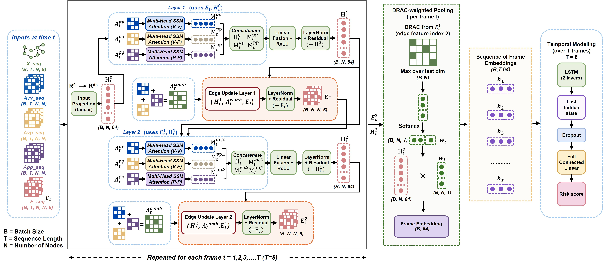

# HERMES

## Heterogeneous Edge-Relational Multi-Head SSM-Embedded Attention for Traffic Conflict Prediction at Signalized Intersections

HERMES is a physics-informed, heterogeneous graph neural framework for proactive traffic conflict prediction at signalized intersections. The framework represents each traffic scene as a temporal sequence of multi-agent graphs, where vehicles and pedestrians are modeled as nodes and their interactions are represented through typed vehicle-vehicle, vehicle-pedestrian, and pedestrian-pedestrian edges.

Unlike conventional approaches that process surrogate safety measures as isolated thresholds or flat feature vectors, HERMES embeds interaction-level safety descriptors directly into the graph-learning process. Relation-specific multi-head attention, dynamic node-edge refinement, DRAC-weighted graph pooling, and temporal sequence learning are jointly optimized to estimate a scene-level probability of imminent conflict.

<p align="center">
  
</p>

<p align="center"><b>Architecture of the proposed HERMES framework.</b></p>

## Research motivation

Surrogate safety measures such as Time-to-Collision (TTC) and Deceleration Rate to Avoid Crash (DRAC) support proactive safety analysis without requiring crashes to occur. However, commonly used conflict-prediction methods have three important limitations:

1. Road-user interactions are often evaluated as independent pairs rather than as a coupled traffic scene.
2. Spatial topology and agent-to-agent dependencies are frequently removed when trajectory and conflict information are converted into flat feature vectors.
3. Surrogate safety measures are usually supplied as external predictors instead of being embedded within the model's relational reasoning mechanism.

HERMES addresses these limitations by formulating conflict anticipation as a scene-level heterogeneous graph classification problem.

## Main contributions

- **Scene-level heterogeneous graph representation:** Vehicles and pedestrians are represented jointly within each frame, preserving direct and indirect multi-agent interaction pathways.
- **SSM-embedded relational attention:** Physics-informed edge descriptors guide relation-specific attention toward safety-critical interactions.
- **Dynamic node-edge refinement:** Updated node states refine edge criticality, while updated edge states subsequently improve node representations.
- **DRAC-weighted graph pooling:** Frame-level embeddings prioritize agents involved in interactions with higher evasive-demand intensity.
- **Temporal conflict modeling:** A two-layer LSTM models the evolution of frame-level safety representations across the observation sequence.
- **Three-tier benchmarking:** HERMES is evaluated against conventional machine-learning, temporal deep-learning, and graph-based baselines using consistent trajectory-derived inputs and evaluation settings.

## Model architecture

For a batch size \(B\), sequence length \(T\), and maximum number of road users \(N\), the model receives:

- Node-feature sequence: `X_seq` with shape `(B, T, N, 9)`
- Vehicle-vehicle adjacency sequence: `Avv_seq` with shape `(B, T, N, N)`
- Vehicle-pedestrian adjacency sequence: `Avp_seq` with shape `(B, T, N, N)`
- Pedestrian-pedestrian adjacency sequence: `App_seq` with shape `(B, T, N, N)`
- Edge-feature sequence: `E_seq` with shape `(B, T, N, N, 6)`

The computational sequence is:

1. Project the input node features into a latent representation.
2. Apply relation-specific multi-head SSM attention for vehicle-vehicle, vehicle-pedestrian, and pedestrian-pedestrian interactions.
3. Concatenate relation-specific messages and fuse them through a linear layer, nonlinear activation, residual connection, and layer normalization.
4. Update edge representations using the current node embeddings, combined adjacency structure, and previous edge states.
5. Repeat heterogeneous graph propagation and edge refinement in a second graph layer.
6. Extract DRAC from the refined edge tensor and calculate node-level pooling weights.
7. Aggregate the final node embeddings into a 64-dimensional frame representation.
8. Process the ordered frame embeddings with a two-layer LSTM.
9. Transform the final hidden state through dropout and a fully connected layer to obtain the scene-level conflict-risk score.

## Repository structure

```text
.
├── sample-data/
│   └── Coldwater_MI_2025-Sep-20_12-10-20_PM.csv
├── assets/
│   └── hermes.jpg
├── 1_trajectory_extraction.ipynb
├── 2_analysis.ipynb
├── 3_transfer_study.ipynb
└── README.md
```

### Notebook sequence

| Notebook | Purpose |
|---|---|
| `1_trajectory_extraction.ipynb` | Loads and prepares trajectory records for downstream processing. The notebook should be executed first because it establishes the trajectory-level inputs used by later analyses. |
| `2_analysis.ipynb` | Conducts the principal conflict-analysis and modeling workflow, including the processing steps implemented for feature construction, evaluation, and result generation. |
| `3_transfer_study.ipynb` | Evaluates model transfer to a different traffic environment and examines performance under site-level domain shift. |

The notebooks are intended to be executed in numerical order.

## End-to-end workflow

```text
Video or tracked-object data
        |
        v
Trajectory preparation and quality control
        |
        v
Coordinate transformation and trajectory smoothing
        |
        v
Node-feature and pairwise interaction construction
        |
        v
Surrogate safety measure computation
        |
        v
Heterogeneous scene-graph construction
        |
        v
Temporal sequence generation
        |
        v
HERMES training and validation
        |
        v
Benchmark, low-false-alarm, ablation, and transfer analyses
```

## Citation

Until the journal article is formally published, the thesis may be cited as:

```bibtex
@mastersthesis{islam2026hermes,
  author  = {Islam, Md Monzurul},
  title   = {HERMES: Heterogeneous Edge-Relational Multi-Head SSM-Embedded Attention for Traffic Conflict Prediction at Signalized Intersections},
  school  = {Texas State University},
  year    = {2026},
  type    = {Master's thesis}
}
```

## Author

**Md Monzurul Islam**  
Artificial Intelligence in Transportation Lab  
Texas State University

## License
Apache License 2.0
